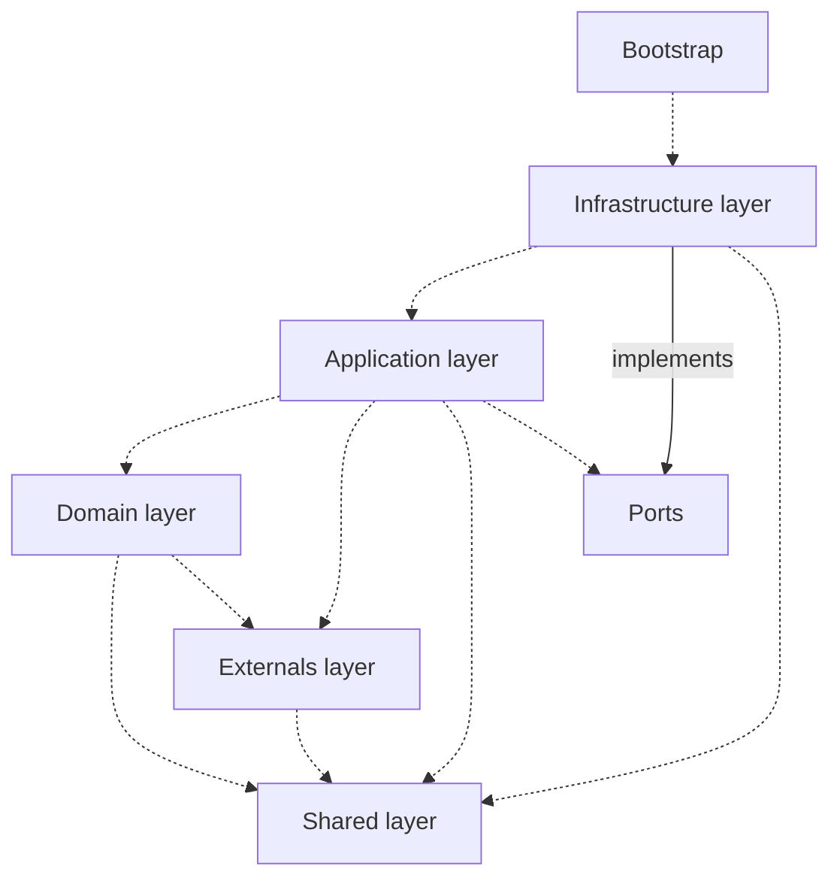

# code challenge

## Tools

- Docker and docker-compose:
  * Those tools are being used to bootstrap the application and the infrastructure dependencies.

## Configure your environment

1. Open project on Visual Studio 2022: 

2. Set docker-compose as startup project:

3. Run Project:

Web App: 

http://localhost:5100

Catalog Api (Products):  

http://localhost:5400/api/product

EF migration will insert sample products during project execution

Order Api:  

http://localhost:5200/api/orders

RabbitMq:

http://localhost:15672

Catalog Db (Sql server)

localhost,1404

Order Db (Sql server)

localhost,1403

-------

## Architecture

We followed principles of the Onion Architecture plus concepts from Clean Code. 

# Architecture model

We adopted the Onion Architecture model with an emphasis on DDD (domain-driven design) and Clean Architecture practices (inspired on Ports and Adapters too) to define the rules of our domain. In this model, the application is divided into 4 (four) main parts:

1. **shared layer** - utilities used by the application with **no domain relationship**;
2. **externals layer** - it contains data types and sub-domain services and from external sources (usually, another micro-service). If you need to store an external data into our domain layer, then evaluate creating a wrapper over it (a model);
3. **domain layer** - it contains the domain models and algorithms to solve our problem without any external dependencies. The models are aggregate roots, persistence-ignorant abstractions, modeled with an emphasis on the problem to be solved and with an attempt to be correct by its definition (making invalid states not representable, as possible);
4. **application layer** - also known as the business layer, this is where we define and execute business rules of the application. Each service might manipulate one or more aggregate models of our domain in a single "unit of work." This layer orchestrates the execution flow to accomplish some functional and non-functional requirements of the application, but ignores details like persistence, caching, configuration, etc. Those are known and well specified, but the application layer doesn't know about its implementation details;
5. **infrastructure layer** - this is where we bind our application to tools and external services that we want to use like databases etc. Its responsibility is to provide the implementation to those services required by the application to run by adapting and delegating when necessary. For example, developers commonly define their domain models with the database in mind. The consequences are that your models will be a hostage to the database persistence model, and not on how they will solve the problem. By abstracting those details from the application, we allow the core of our system (domain + application) to be purely focused on what matters, solving the problem.

## Dependency layer

* Ports are interfaces for non domain services. It could be an external service or an infrastructure service.

## Application core

The application core is a common term used to describe the domain and application layers.

